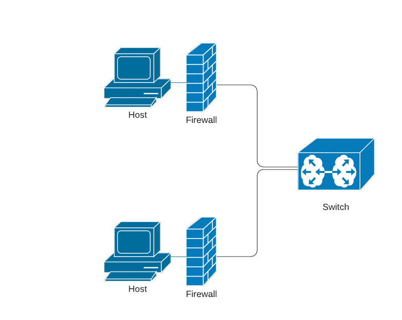
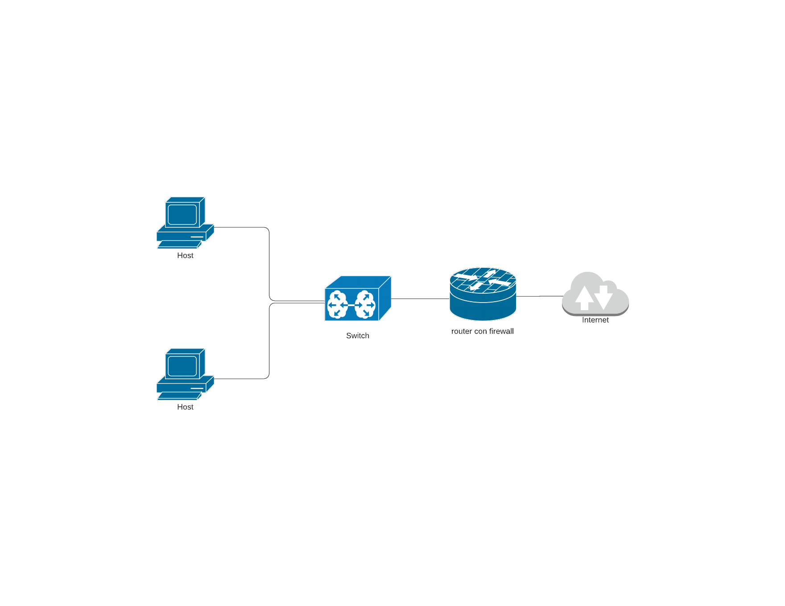
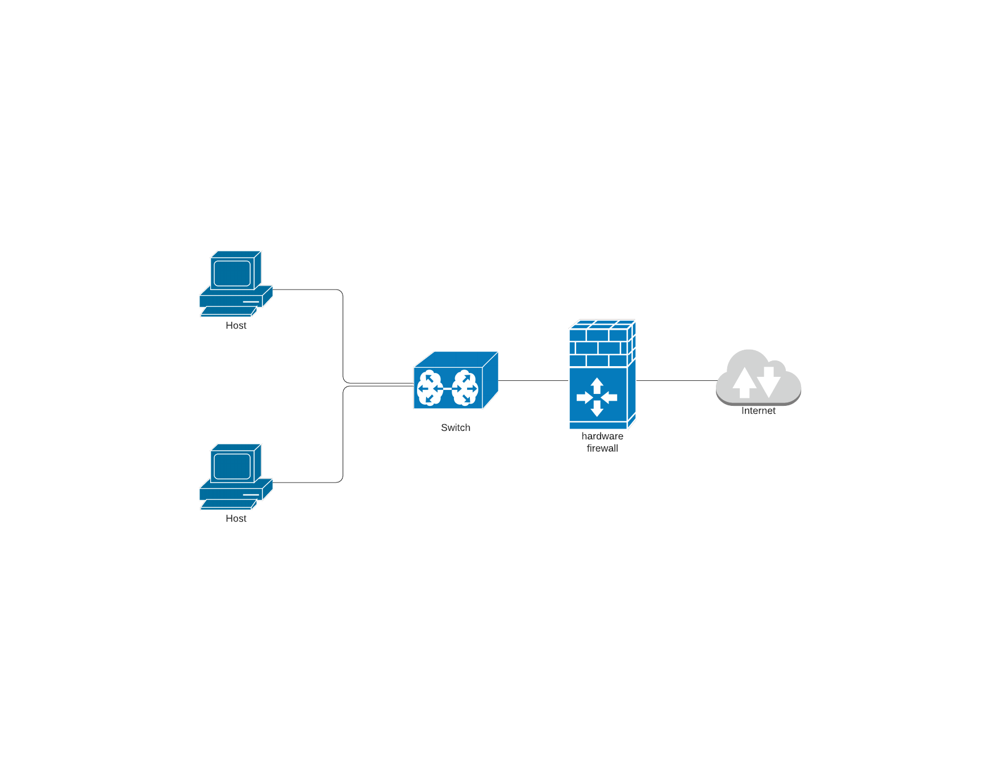
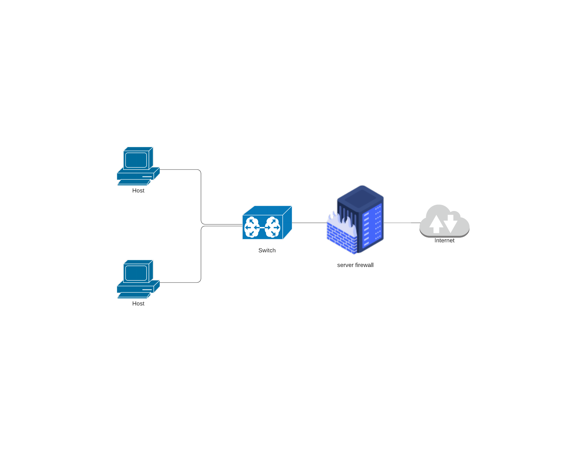

# **Firewall**
Il Firewall indica un processo attivo su un sistema in grado di controllare, a vari livelli, il contenuto dei pacchetti in entrata e in uscita su una o più interfacce di rete al fine di impedire il transito di pacchetti non autorizzati.

---

## **Tipologie**

### _personal firewall_
I sistemi firewall possono essere dei programmi software da installare su un host di una rete sicura. Il programma ha lo scopo di proteggere l'host e controlla il traffico che circola sulla sua scheda di rete. 
  

### _firewall perimetrale_
Con firewall perimetrale ci si riferisce a quei tipi di firewall che vengono più comunemente riconosciuti come firewall: quelli installati su  almeno due interfacce di un apparato router, una di queste è connessa ad una rete sicura (_ex. rete privata, anche detta **trust**_) e l'altra ad una rete insicura (_ex. Internet, rete pubblica_).  
  

Queste tipologie di firewall si diramano a loro volta in:

- **firewall hardware**: 
un processo che effettua il controllo nelle interfacce di un apparato hardware con almeno due interfacce di rete.
Anche in questo apparato un'interfaccia deve essere collegata ad una rete trust e l'altra ad una rete sicura; facendo ciò questo apparato hardware svolge anche la funzione di router e può sostituirlo come apparato di (inter)connessione fra una rete privata ed una rete pubblica.  
  

- **application layer firewall**: 
un'applicazione di livello 7 (Application layer: 7o ed ultimo livello ISO/OSI) che opera su più interfacce di rete di una macchina server che agisce da router; questo tipo di firewall può essere integrato con applicazioni di rete che effettuano il controllo della connessione e l'ottimizzazione del traffico.  
  

## **classificazione per livello di controllo**
I firewall si possono classificare, oltre che per tipo di apparato e livello nel quale agiscono, anche in base al tipo di ispezione che effettuano:

### _packet filter_
Funzionalità minima che controlla il traffico a livello IP e ispezione il flag SYN di TCP per intercettare tentativi di connessione.
> qui si agisce sul terzo livello della pila ISO/OSI, quello di rete; effettuare un controllo su questo livello è indispensabile per poter bloccare o permettere il traffico tra sottoreti e/o reti pubbliche.

### _stateful inspection_
Verifica la qualità delle connessioni di tipo TCP controllandone i pacchetti, più nello specifico le loro intestazioni (header)

> qui si agisce sul quarto livello della pila ISO/OSI, quello di trasporto; effettuare un controllo su questo livello è necessario per intercettare il traffico TCP che, apparentemente, appartiene ad una connessione alla quale, nei fatti, non appartiene (tentativo di intrusione).

### _deep inside_
Analizza il traffico dei pacchetti fino al 7o ed ultimo livello della pila ISO/OSI (_Application layer_); nello specifico analizza il corretto uso dei protocolli a livello applicativo e ne ispeziona il contenuto.
In base ad un glossario su un database nel quale sono raccolte le firme dei virus o applicativi d'intrusione più diffusi, questo tipo di processo riesce ad intercettarli.
Dato che questo tipo di funzionalità richiede una notevole capacità prestazionale, questo tipo di processo firewall è solitamente presente su apparati dedicati o firewall a livello applicativo su host dedicati (_ex. proxy server_).

## **Access Control List (ACL)**
Esprime la lista dei permessi d'uso legati ad un determinato oggetto e, nel mondo dell'informatica, viene utilizzata nei SO e nelle reti, sottoforma di regole da valutare in modo tale che un processo possa poi prendere una decisione coerente. 

Ogni singolo criterio di una ACL è detto **ACE** (_Access Control Entry_) o, semplicemente, _regola_.

La sua sintassi non rispetta standard noti e dunque può variare in base alle tecnologie utilizzate; ciononostante ci è possibile stabilire alcuni **criteri** per scrivere una ACE che verranno poi utilizzati dai processi firewall:
- obiettivo: cosa fare del pacchetto ricevuto (scartarlo o inoltrarlo);
- interfaccia e verso: su quale interfaccia applicare la entry e in quale verso (input, dall'interfaccia verso il router, o viceversa con output).
- specifiche: le caratteristiche del pacchetto fra le quali le più importanti sono l'indirizzo IP, la rete di appartenza, il numero di porta (TCP o UDP) ed il protocollo.

Le regole di una ACL sono riportate con un numero d'ordine che riflette la restrittivit: le prime sono più restrittive.

> Per ogni pacchetto vengono verificate le entry a partire da quelle più restrittive: la prima che risulta verificata per il pacchetto viene applicata.

## **Sicurezza**
Il firewall è un servizio progettato per fornire sicurezza a una rete.

I _bastion host_ devono essere particolarmente attrezzati per respingere ogni tentativo di intrusione; per far ciò questi devono possedere un SO sicuro (_ex. sempre aggiornato_), con pochissimo account d'accesso ed un numero minimo di processi attivi.

> bastion host: apparato esposto alla rete pubblica nel quale gira un processo firewall.

I tentativi di intrusione che un firewall può contrastare sono molteplici, di seguito sono indicati alcuni fra i più conosciuti.

### _IP spoofing_
Con questa tecnica si tenta di accedere a servizi di rete simulando un'identità differente da quella reale. Ciò è possibile inviando pacchetto TCP/IP con l'indirizzo IP sorgente falsificato.

### _Denial of Service (DoS)_
Attività intrusiva il cui scopo è mettere in difficoltà un servizio di rete sottoponendolo a stress eccessivo o sfruttandone alcune malfunzioni.

### _IP smurfing_
Una tipica attività di DoS che abusa del programma _ping_. 
1. Il software invia una grande quantità di ICMP Echo Request;
    1. IP sorgente: IP sorgente modificato (**spoof**);
    2. IP destinazione: IP broadcast diretto.
2. il router, se non protetto, inoltra il pacchetto a tutte le sue interfacce (private e pubbliche);
3. essendo la destinazione broadcast, molti host risponderanno all'indirizzo del mittente falsificato con dei pacchetti _ICMP Echo Reply_;
4. il router è costretto dunque ad un'attività stressante.

> Per ovviare a questo problema i firewall hanno spesso una ACL che gli impone di bloccare tutti i pacchetti ICMP con IP destinatario un indirizzo di broadcast.
