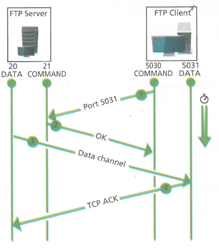
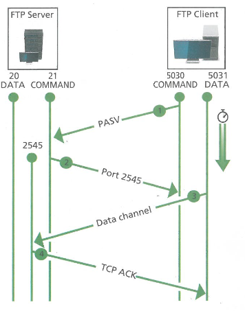

# FTP

Il _File Transfer Protocol_ è un protocollo a livello applicativo che serve per condividere dei file e, anche se è utilizzabile dagli utenti tramite il terminale del proprio dispositivo, è utilizzato principalmente dai programmi.

> L'FTP venne standardizzato negli anni Ottanta e fa uso del protocollo TCP a livello di trasporto, qualche anno dopo la sua standardizzazione uscì una sua versione più leggera denominata TFTP (_Trivial FTP_) che fa uso del protocollo UDP a livello di trasporto.

Anche se al giorno d'oggi ci sono molti modi per trasferire file attraverso la rete (email, chat, web server) che vengono usati largamente per via della familiarità degli utenti con le loro interfacce, questi metodi non sono stati specificatamente pensati per questo e l'FTP risulta dunque più robusto di essi.

---

## **Modalità di lavoro**

FTP utilizza due canali di comunicazione tra client e server:

1. un canale viene utilizzato per l'invio di comandi tra client e server, viene sempre aperto in direzione `client => server` ed utilizza la porta `21` del server, denominata _porta di controllo_

2. l'altro canale viene utilizzato per l'invio dei dati, viene aperto in direzione `server => client` ed utilizza la porta `20` del server, denominata _porta dati_

La connessione tra client e server può avvenire secondo due modalità: FTP active mode e FTP passive mode.

### **_Active mode_**

1. Il client si connette con una porta `N` (> 1023) alla porta di controllo del server e si mette in ascolto nella porta `N+1`
2. Il client invia il comando `Port N+1` al server
3. Il server si connette alla porta specificata dal client con la propria porta dati
4. Il client invia un riscontro (ACK) di conferma ricezione, da questo punto inizia il trasferimento dei dati dalla porta dati del server.  

  

#### **Problematiche**

Non essendo il client FTP a connettersi alla porta dati del server, ma il contrario (esso infatti indica al server a quale porta connettersi), il tentativo di connessione del server potrebbe essere percepito da un possibile firewall attivo nel lato client come un tentativo di intrusione e venir dunque bloccato.

È sconsigliato l'uso della active mode per poter garantire la sicurezza della intranet, evitando di dover aggiungere o rimuovere delle regole al firewall per ovviare alla problematica precedentemente descritta.

### **_Passive mode_**

Il client FTP inizia entrambe le connessioni con il server, sia comandi che dati, risolvendo dunque il problema di filtraggio della connessione da parte del firewall lato client.

1. Il client apre localmente due porte `N` (> 1023) e `N+1`; con la porta `N` contatta il server sulla sua porta comandi inviando il comando `PASV`
2. Il server apre una porta casuale `P` (> 1023) ed invia il comando `Port P` al client sulla sua porta comandi `N`
3. Il client si connette alla porta `P` dalla sua porta `N+1`
4. Il server invia un riscontro (ACK) di conferma ricezione, da questo punto inizia il trasferimento dei dati dalla porta `P` del server  

  

---

## **Modalità di accesso**

FTP ha due modalità di accesso predefinite: utente e anonima.

La modalità utente prevede un accesso al server FTP tramite username e password, mentre con la modalità anonima si ha accesso come utente `anonymous`; quest'ultima è molto utilizzata per lo scambio di dati pubblici e presenta due limitazioni:

- è necessario limitare l'accesso alle sole informazioni che si vogliono diffondere
- non bisogna consentire l'uso di FTP per la distribuzione di materiali di terzi (per esempio rendendo la cartella upload write-only, in modo che gli anonimi no possano leggere gli upload degli utenti)

## **Vulnerabilità**

I maggiori problemi di sicurezza di questo protocollo sono dati dal fatto che non preveda alcun tipo di cifratura, e dunque scambi in chiaro le credenziali degli utenti ed i dati, interecettabili nella rete e leggibili da chiunque sappia usare un packet sniffer.

La soluzione a questo problema è stata una nuova specifica FTP denominata **FTPS** (_FTP over TLS_) che aggiunge un livello fra il transport (TCP) e l'application (FTP), per la gestione della crittografia, che usa il protocollo **TLS** (_Transport Layer Security_).

Altri problemi:

- sessione in due processi: questa rende più semplici le manovre malevole dei malintenzionati
- permessi utente: i permessi FTP vanno incrociati con i permessi utente sul server in modo da poter risparmiare spazio sul disco ed il numero di processi

Con il diffondersi del World Wide Web molti utenti preferiscono usare il browser con FTP client; la maggior parte di essi supporta solo la modalità passiva quando si accede con `ftp://URL`.

## Funzioni comuni ai programmi FTP client

- connessione al server remoto
- **GET:** trasferimento di un file dal server al client
- **PUT:** trasferimento di un file dal client al server
- **DIR:** lettura dei file presenti nella directory corrente del server
- **CD (_Change Directory_):** cambiamento di directory corrente sul server
- disconnessione

Uno dei principali client FTP è _FileZilla_.
